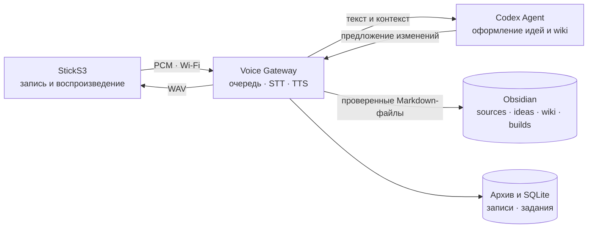
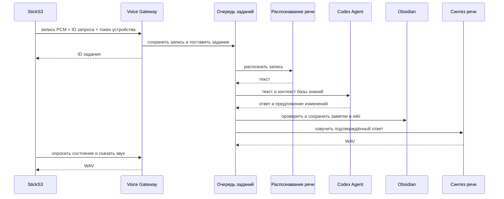

# Архитектура

Затея состоит из диктофона StickS3, Voice Gateway и локального Codex Agent. Устройство записывает и воспроизводит звук. Сервер распознаёт речь, оформляет мысли в Obsidian и синтезирует ответ.

## Компоненты

Codex Agent работает в соседнем контейнере и принимает запросы шлюза только через loopback. Учётные данные Codex доступны только контейнеру агента, не шлюзу и не прошивке. Токен устройства и внутренний токен агента — разные секреты. Для текущего сценария шлюз использует `VOICE_AGENT_PROVIDER=codex`.

## Голосовой запрос

Устройство создаёт UUID перед отправкой записи. При потере ответа оно проверяет этот же запрос, чтобы не создать дубль. Gateway хранит задания в SQLite; ожидающие задания переживают перезапуск, прерванная обработка автоматически не повторяется. Каждое устройство авторизуется своей парой `X-Device-Id` и bearer-токен. Точные HTTP-пути указаны в [протоколе](protocol.md); выбор режима пользователю не требуется.

## Устройство и настройка

StickS3 записывает моно PCM S16LE 16 кГц по нажатию кнопки и воспроизводит WAV через ES8311. Экран показывает состояние записи, обработки, ответа и ошибки. Setup AP называется `Zateya-Setup-XX`; после подключения к Wi-Fi настройки доступны и через локальную сеть по `zateya-<MAC>.local`. [Подключение Wi-Fi](wifi-profiles-sticks3.md) и [прошивка](flash-sticks3.md) описаны отдельно.

## Заметки и хранение

Сырой текст попадает в `Затея/sources/` Obsidian vault, оформленные идеи — в `ideas/`, связанные страницы — в `wiki/`, планы и задания — в `builds/`. Подтверждение озвучивается после записи файлов. Затем отдельный процесс коммитит и отправляет изменения в `origin`; подробности в [руководстве по базе знаний](voice-knowledge.md).

Записи и служебные результаты хранятся под `ARCHIVE_ROOT/YYYY/MM/DD/<turn-id>/`; очередь — в SQLite. `/health/live` проверяет процесс, `/health/ready` — конфигурацию и архив, `/metrics` отдаёт метрики без текста записей. Gateway предназначен для доверенной локальной сети или VPN; setup AP открыт для настройки.
