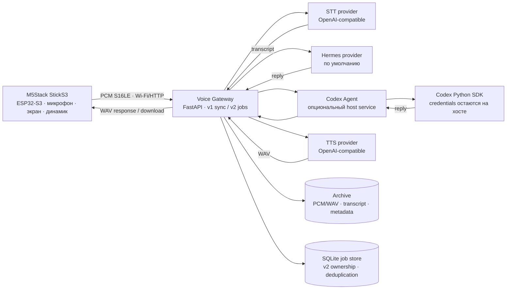
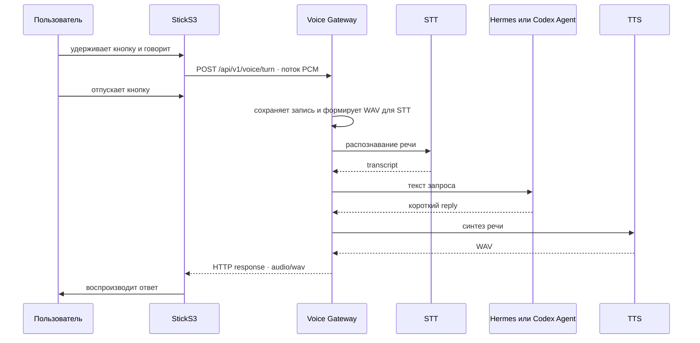
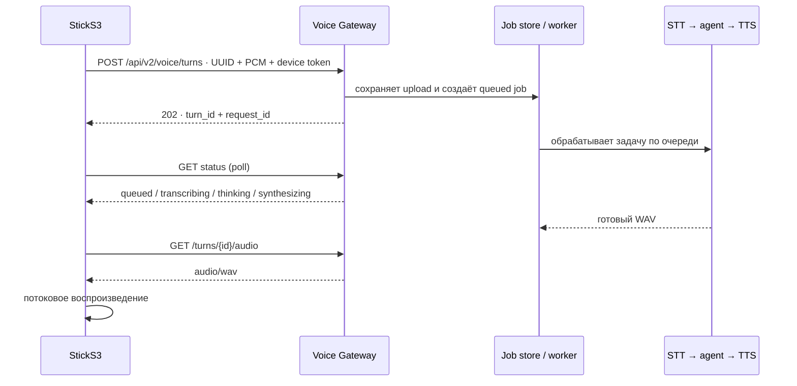

# Архитектура

Проект разделяет устройство, Voice Gateway и (опционально) локальный Codex Agent. StickS3 отвечает за захват и воспроизведение звука; STT, выбор агента, TTS и архив находятся на стороне сервера.

## Компоненты и границы

Gateway выбирает ровно одного conversational provider: `VOICE_AGENT_PROVIDER=hermes` (значение по умолчанию) либо `codex`. STT и TTS конфигурируются отдельно. Сервис Codex слушает только loopback; его bearer token — внутренний ключ между gateway и adapter, а не пароль устройства или Codex credential.

## Путь голосового запроса

### V1 · синхронный

Gateway архивирует turn по UUID: исходное аудио, transcript, ответ и metadata. Наличие STT, agent и TTS зависит от конфигурации; для полного голосового цикла должны быть настроены все три стадии.

### V2 · задача с сохранением состояния

Перед первой отправкой устройство создаёт UUID запроса. При потере ответа на upload оно проверяет этот же UUID, а не загружает запись с новым идентификатором. Gateway сохраняет v2 job и переживает рестарт процесса: queued задачи восстанавливаются, прерванные во время обработки автоматически не повторяются. Для одного устройства действует отдельное право доступа по паре `X-Device-Id` + bearer token.

## Прошивка

Цель — M5Stack StickS3 на ESP32-S3 с ESP-IDF и PlatformIO. Board-specific код отделён от voice state machine. Кнопка запускает push-to-talk; PCM S16LE, mono, 16 kHz передаётся частями, а ответ WAV проверяется и воспроизводится через ES8311.

Состояния: `BOOT → IDLE → RECORDING → PROCESSING → PLAYING → IDLE`; ошибка восстанавливается нажатием кнопки без перезагрузки. В v2 request ID и turn ID хранятся в NVS, а HTTP polling выполняется отдельно от основного UI loop.

Wi-Fi setup AP имеет SSID `Hermes-StickS3-Setup-XX`, где `XX` — последний байт Wi-Fi MAC. Если сохранённая сеть не выдала IP за минуту, устройство включает setup AP и продолжает повторные подключения. После получения IP AP останавливается. См. [иллюстрацию Wi-Fi fallback](assets/wifi-setup-flow.svg) и [инструкцию прошивки](flash-sticks3.md).

## Сервис Codex Agent

Это отдельное приложение на host-компьютере. Оно обращается к закреплённому `openai-codex` SDK и стандартной авторизации Codex локального пользователя. Сервис сохраняет SQLite-соответствие `device_id → thread_id`, принимает запросы от gateway по loopback и не монтирует домашний каталог Codex в контейнер. Один device продолжает собственный разговор; reset создаёт новую сессию. Детали — в [инструкции deployment](../deploy/codex-voice-agent.md).

## Архив, заметки и метрики

Audio turn и служебные результаты сохраняются под `ARCHIVE_ROOT/YYYY/MM/DD/<turn-id>/`. Для v2 используется SQLite job database (по умолчанию внутри archive). `/health/live` проверяет только доступность процесса; `/health/ready` проверяет обязательную конфигурацию и возможность записи в archive. Временная недоступность удалённого STT или TTS сама по себе не делает процесс unhealthy. `/metrics` отдаёт Prometheus metrics без transcript и произвольного текста в labels.

В репозитории есть реализация `NoteStore` для Obsidian, но текущий активный voice pipeline не записывает заметки в vault. Не считайте наличие переменных `OBSIDIAN_*` подтверждением работающей записи заметок.

## Безопасность

- Gateway рассчитан на доверенную локальную сеть; текущая конфигурация использует HTTP, не TLS.
- Не публикуйте gateway или открытую setup AP напрямую в Internet.
- Для v2 настройте уникальный token для каждого устройства. MAC/device ID — идентификатор, но не секрет.
- Codex adapter должен слушать `127.0.0.1`; держите его token отдельно от device token.
- `.env`, Wi-Fi пароль, tokens и Codex credentials не сохраняйте в репозитории или логах.
