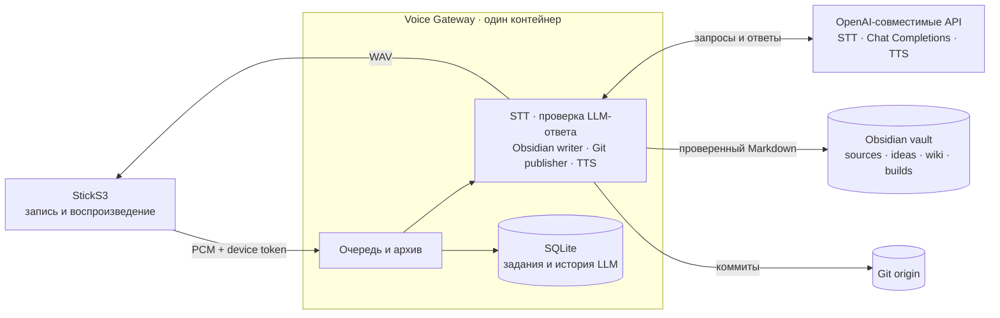
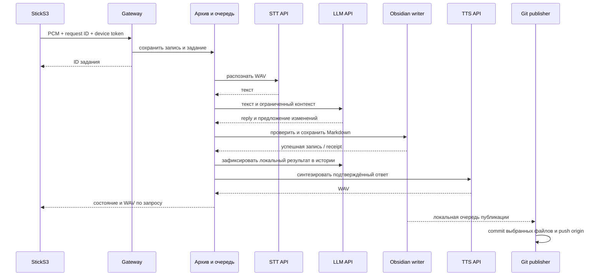

# Архитектура

Затея состоит из диктофона StickS3, одного Voice Gateway, внешних сервисов распознавания/LLM/синтеза и Obsidian vault. Gateway выполняет голосовой сценарий, запись знаний и Git-публикацию в одном контейнере.

## Компоненты

К Gateway настроенный Chat Completions API получает речь и выбранный контекст базы как данные. Он не получает инструменты, доступ к файлам, Git или SSH-ключи. Gateway проверяет JSON по существующей схеме и применяет изменения через Obsidian writer. API-ключи хранятся в серверном `.env`; устройство получает только свой токен для Gateway.

## Голосовой запрос

Устройство создаёт UUID перед отправкой записи. Повтор с тем же запросом не создаёт новую задачу. Gateway кеширует проверенный результат LLM по паре device ID/request ID, поэтому повтор после сбоя синтеза не вызывает LLM второй раз и не создаёт повторную заметку. Краткая история хранится отдельно в `/data/archive/llm-sessions.sqlite3` и сбрасывается для каждого устройства отдельно.

## Настройка устройства и сервера

StickS3 записывает моно PCM S16LE 16 кГц по нажатию кнопки и воспроизводит WAV через ES8311. Setup AP называется `Zateya-Setup-XX`; после подключения к Wi-Fi полный веб-интерфейс доступен также через IP или mDNS `zateya-<MAC>.local`.

Compose запускает один backend под числовым непривилегированным UID/GID. `data/archive`, `data/obsidian` и read-only `data/ssh` монтируются с хоста. Скрипт `deploy/prepare-data.sh` согласует владельца с Compose и не удаляет существующие данные. Подробности перехода — в [серверном runbook](../deploy/server-migration.ru.md).

## Obsidian и проверки

Исходники лежат в `Затея/sources/`, идеи — в `ideas/`, связанные страницы — в `wiki/`, планы и задания — в `builds/`. Публикация коммитит только файлы из outbox; ручные staged-изменения сохраняются. Push работает в фоне и не задерживает голосовой ответ. Статус доступен через авторизованный `GET /api/voice/knowledge/git`.

`/health/live` проверяет процесс. `/health/ready` проверяет настройки и запись в архив без сетевых вызовов. Доступ к gateway ограничьте доверенной сетью; не публикуйте его напрямую в Интернет.
