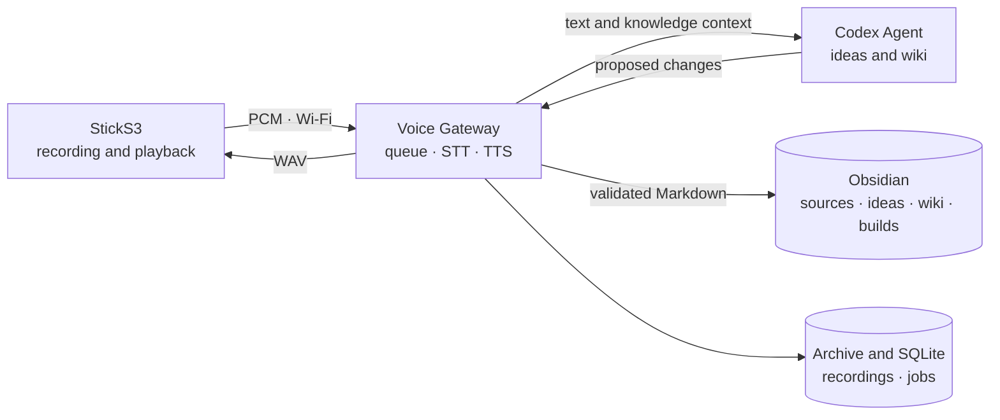
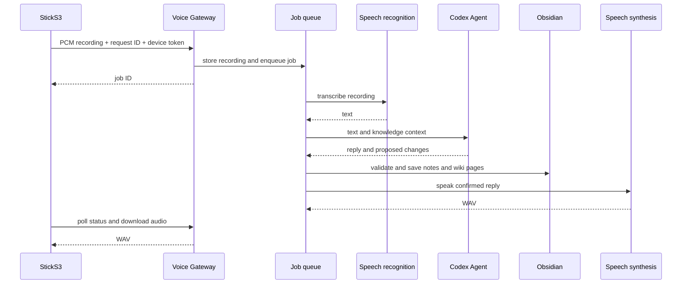

# Architecture

Zateya consists of the StickS3 recorder, Voice Gateway, and a local Codex Agent. The device records and plays audio. The server transcribes speech, organizes ideas in Obsidian, and synthesizes the spoken reply.

## Components

The Codex Agent runs on the host and accepts gateway requests over loopback. Codex credentials never enter the container or firmware. The device token and the agent's internal token are separate secrets. The current deployment uses `VOICE_AGENT_PROVIDER=codex`.

## Voice request

The device creates a UUID before upload. If the response is lost, it checks the same request to avoid duplicates. The gateway keeps jobs in SQLite; queued jobs survive restarts, while interrupted processing is not automatically replayed. Each device is authorized with its own `X-Device-Id` and bearer-token pair. See the [protocol guide](protocol.md) for exact HTTP paths; setup does not offer protocol selection.

## Device and setup

The StickS3 records mono 16 kHz PCM S16LE on button press and plays WAV through the ES8311. The display shows recording, processing, reply, and error states. Its setup AP is named `Zateya-Setup-XX`; after joining Wi-Fi, setup is also available on the local network at `zateya-<MAC>.local`. See [Wi-Fi setup](../wifi-profiles-sticks3.md) and [flashing](flash-sticks3.md).

## Notes and storage

Raw transcripts go to `Hermes/sources/` in the Obsidian vault, formatted ideas to `ideas/`, connected pages to `wiki/`, and plans and tasks to `builds/`. The spoken confirmation follows successful file writes. A separate publisher then commits and pushes changes to `origin`; see the [knowledge guide](../voice-knowledge.md).

Recordings and results are archived under `ARCHIVE_ROOT/YYYY/MM/DD/<turn-id>/`; jobs are stored in SQLite. `/health/live` checks the process, `/health/ready` checks configuration and archive writability, and `/metrics` excludes transcript text. The gateway is intended for a trusted local network or VPN; the setup AP is open for provisioning.
