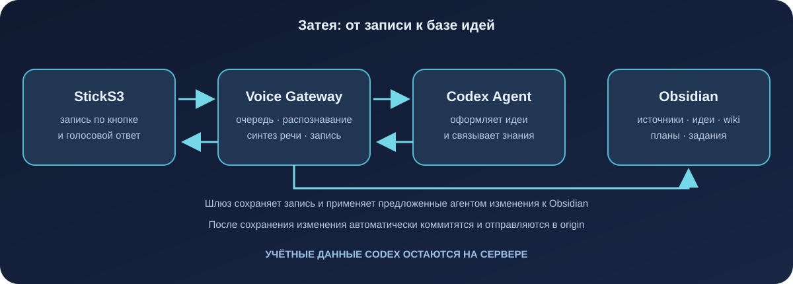
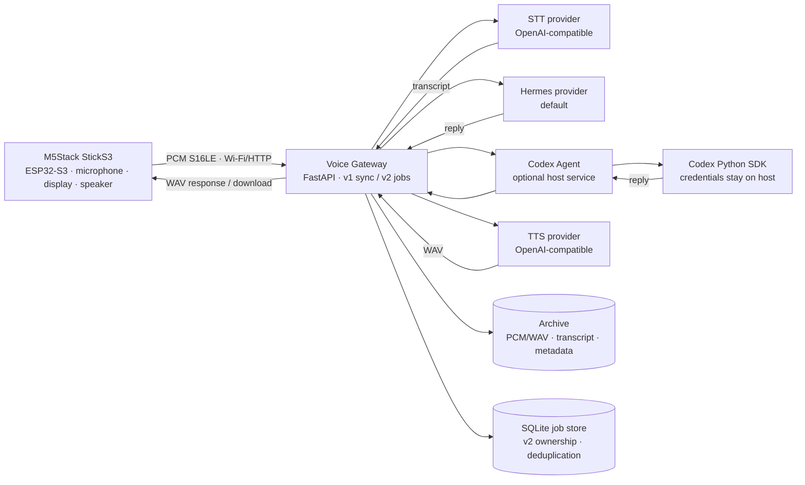
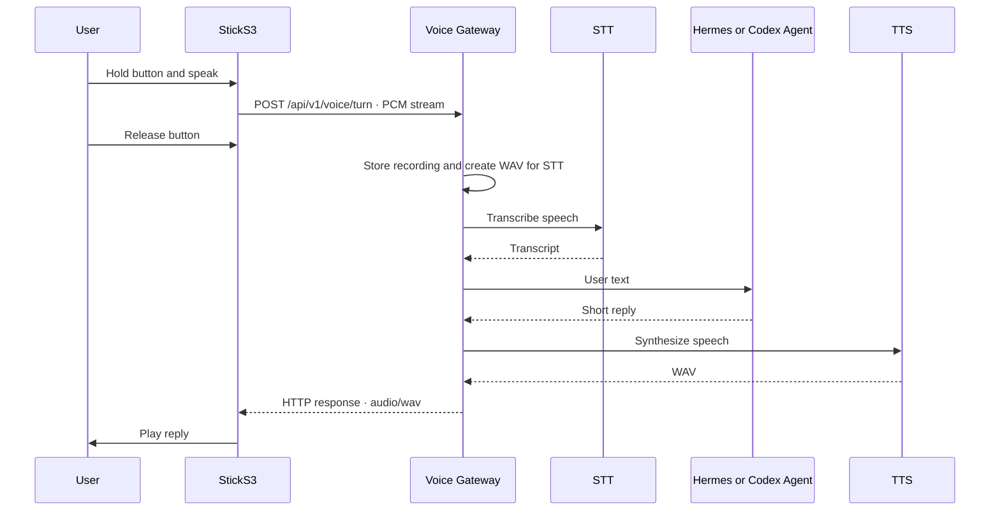
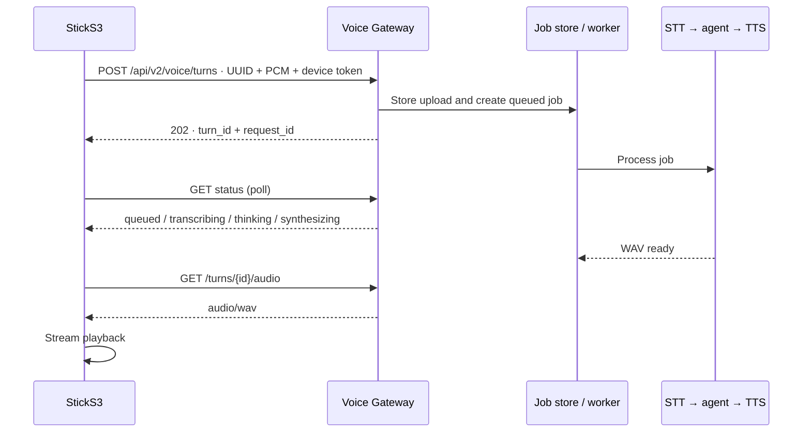

# Architecture

The system separates the StickS3 device, Voice Gateway, and optional local Codex Agent. The device captures and plays audio; speech recognition, agent selection, synthesis, and archiving run on the server side.

## Components and boundaries

The gateway selects exactly one conversational provider: `VOICE_AGENT_PROVIDER=hermes` (default) or `codex`. STT and TTS are configured separately. The Codex service listens on loopback only. Its bearer token is an internal gateway-to-adapter secret, not a device password or Codex credential.

## Voice request flow

### V1 — synchronous

The gateway archives each turn under a UUID: source audio, transcript, reply, and metadata. STT, agent, and TTS availability depends on configuration; all three stages are needed for a complete spoken round trip.

### V2 — durable asynchronous job

Before upload, the device creates a request UUID. If the upload response is lost, it checks that same UUID rather than uploading again under a new ID. The gateway stores v2 jobs in SQLite. Queued jobs are recovered after process restart; jobs interrupted while running are not automatically replayed. Each device is authorized using its `X-Device-Id` and bearer-token pair.

## Firmware

The target is M5Stack StickS3 (ESP32-S3) with ESP-IDF and PlatformIO. Board-specific code is separated from the voice state machine. Push-to-talk captures mono 16 kHz PCM S16LE in chunks; the device validates and plays the WAV response through the ES8311 codec.

States: `BOOT → IDLE → RECORDING → PROCESSING → PLAYING → IDLE`. An error is cleared by a button press, without a reboot. In v2, request and turn IDs are stored in NVS; HTTP polling does not block the main UI loop.

The Wi-Fi setup AP is named `Hermes-StickS3-Setup-XX`, where `XX` is the final Wi-Fi MAC byte. If the saved network has not assigned an IP after one minute, setup AP starts while station reconnection continues. The AP stops after an IP is obtained. See the [Wi-Fi recovery diagram](../assets/wifi-setup-flow.en.svg) and [device setup guide](flash-sticks3.md).

## Codex Agent Service

This is a separate application on the host. It uses the pinned `openai-codex` SDK and the signed-in local Codex user's standard authentication. A SQLite mapping from `device_id` to `thread_id` keeps each device's conversation. The gateway connects over loopback; the container does not mount the host's Codex home. Reset starts a new conversation. See the [deployment guide](../../deploy/codex-voice-agent.md).

## Archive, notes, and metrics

Voice turns and results are stored under `ARCHIVE_ROOT/YYYY/MM/DD/<turn-id>/`. V2 uses a SQLite job database (by default inside the archive). `/health/live` checks process liveness only; `/health/ready` checks required configuration and archive writability. A temporary outage at a remote STT or TTS provider does not by itself make the process unhealthy. `/metrics` exposes Prometheus metrics without transcripts or arbitrary text in labels.

The repository includes an Obsidian `NoteStore` implementation, but the active voice pipeline does not currently write notes to a vault. The presence of `OBSIDIAN_*` variables does not mean note writing is active.

## Security

- The gateway is intended for a trusted local network. Current connections use HTTP, not TLS.
- Do not expose the gateway or open setup AP directly to the Internet.
- Configure a unique token per device for v2. A MAC address/device ID identifies a device; it is not a secret.
- Bind the Codex adapter to `127.0.0.1`; keep its token separate from device tokens.
- Never commit `.env`, Wi-Fi passwords, tokens, or Codex credentials. Do not put them in logs.
