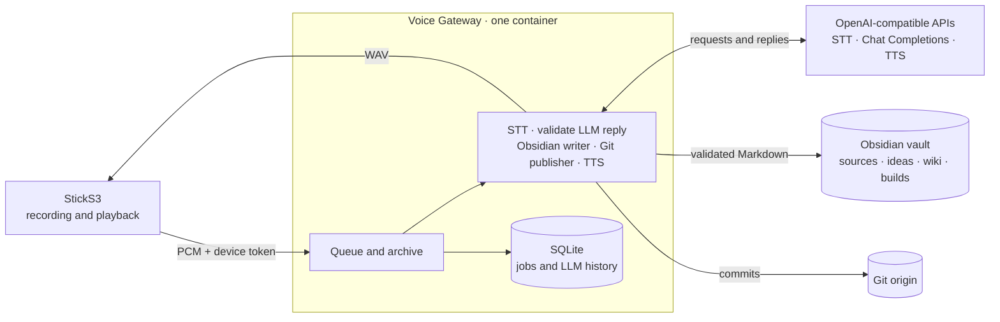
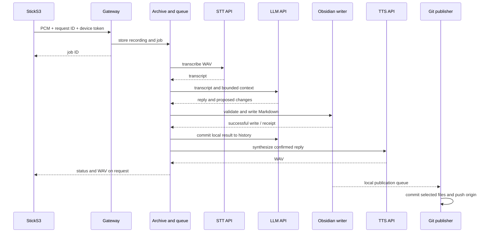

# Architecture

Zateya consists of the StickS3 recorder, one Voice Gateway, external speech/LLM APIs, and an Obsidian vault. The gateway handles voice processing, knowledge writing, and Git publishing in a single container.

## Components

The configured Chat Completions API receives the transcript and selected knowledge context as data. It receives no tools, filesystem access, Git access, or SSH keys. The gateway validates JSON against the existing schema and applies changes through the Obsidian writer. API keys stay in the server-side `.env`; the device gets only its gateway token.

## Voice request

The device creates a UUID before upload. Reusing the same request does not create another job. The gateway caches each validated LLM result by device ID and request ID, so a retry after TTS failure does not call the LLM again or duplicate a note. Short conversation history is stored separately in `/data/archive/llm-sessions.sqlite3` and reset per device.

## Device and server setup

StickS3 records mono PCM S16LE at 16 kHz on button press and plays WAV through ES8311. Its setup AP is `Zateya-Setup-XX`. After joining Wi-Fi, full setup is also available through the device IP or mDNS name `zateya-<MAC>.local`.

Compose runs one backend as a numeric non-root UID/GID. `data/archive`, `data/obsidian`, and read-only `data/ssh` are mounted from the host. `deploy/prepare-data.sh` aligns ownership with Compose without deleting existing data. See the [server runbook](../../deploy/server-migration.ru.md).

## Obsidian and health checks

Sources live in `Затея/sources/`, ideas in `ideas/`, related pages in `wiki/`, and plans/tasks in `builds/`. The publisher commits only files from the outbox and preserves unrelated staged changes. Push runs in the background so it does not delay the spoken response. Its status is available at authenticated `GET /api/voice/knowledge/git`.

`/health/live` checks the process. `/health/ready` validates configuration and archive writes without network calls. Restrict gateway access to a trusted network; do not expose it directly to the Internet.
