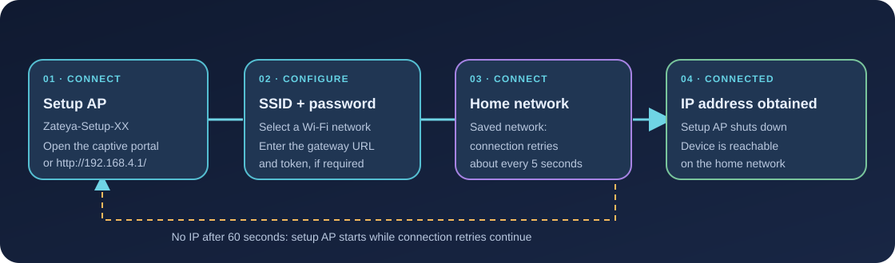

# Configure and flash the M5Stack StickS3

This guide covers Wi-Fi provisioning and the PlatformIO build for the StickS3 (ESP32-S3). A successful build does not replace checking the firmware on the physical device.



## Before you start

- M5Stack StickS3 and a USB cable that supports data.
- A 2.4 GHz Wi-Fi network the device can join.
- Voice Gateway running on a network reachable by the device.
- PlatformIO Core to build; a serial monitor for diagnostics.

## Configure Wi-Fi with the captive portal

1. On first boot, connect your phone or computer to `Hermes-StickS3-Setup-XX`. `XX` is the final Wi-Fi MAC byte in lowercase hexadecimal.
2. Accept the prompt to open the network setup page. If it does not appear, browse to `http://192.168.4.1/`.
3. Select your home SSID from the scan list or enter it manually. Enter its password and the gateway endpoint.
4. Keep protocol v1 unless you have configured v2 tokens. For v1, enter the full URL ending in `/api/v1/voice/turn`. For v2, enter only the base URL, select v2, and enter the device token.
5. Select **Save & Restart**. After reboot, the device connects using the saved settings.

Leave the password or token blank to keep its saved value. For v2, the gateway must map the device ID to its token using `VOICE_DEVICE_TOKENS`. A MAC address is an identifier, not a secret. The setup page has no password, but firmware accepts its requests only from the setup subnet.

If the saved network has not assigned an IP after 60 seconds, the device starts the setup AP and continues retrying the network about every five seconds. The AP shuts down after an IP is obtained. The AP is open; if the captive prompt does not appear, connect manually and open the address above.

## Build

From the repository root:

```sh
cd firmware
export HERMES_WIFI_SSID='your-network'
export HERMES_WIFI_PASSWORD='your-password'
export HERMES_GATEWAY_URL='http://192.168.1.10:8080/api/v1/voice/turn'
pio run -e sticks3
```

Build flags read these three values from the environment and embed defaults in the image. Firmware also stores portal settings in NVS. Do not commit real build values, tokens, or passwords. The device ID is derived from the full Wi-Fi MAC and shown in the UI.

## Flash and view the serial log

Connect the device and find its serial port:

```sh
pio device list
pio run -e sticks3 -t upload --upload-port /dev/ttyACM0
pio device monitor --port /dev/ttyACM0 --baud 115200
```

Replace `/dev/ttyACM0` with your port. The StickS3 may require manual download mode: hold KEY1 while reconnecting USB, then retry the upload. PlatformIO is configured not to reset automatically during upload, so enter download mode manually if needed.

To test firmware host-side logic without a device:

```sh
cd firmware
pio test -e native
```

A native test/build does not prove operation on the physical audio codec or connectivity to Wi-Fi and the gateway. After flashing, separately check the boot log, home network connection, a voice request, and audio playback.

## Device display

The LCD shows `ГОТОВ`, `СЛУШАЮ`, `ДУМАЮ`, `ОТВЕЧАЮ`, and `ОШИБКА` (READY, LISTENING, THINKING, SPEAKING, and ERROR). The error screen stays visible until you press the button. There is no separate LED indication.
