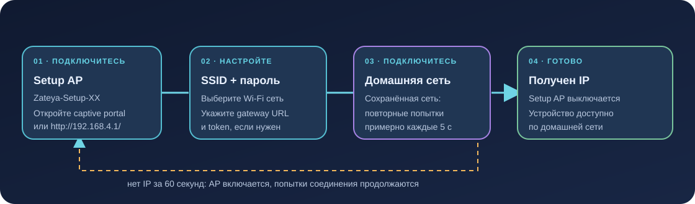

# Настройка и прошивка M5Stack StickS3

Инструкция для StickS3 (ESP32-S3). Она описывает provisioning по Wi-Fi и PlatformIO build. Подключение к реальному устройству и успешная прошивка должны проверяться отдельно.



## Что понадобится

- M5Stack StickS3 и USB-кабель с передачей данных.
- Wi-Fi 2.4 GHz, к которому устройство сможет подключиться.
- Запущенный Voice Gateway в той же доступной сети.
- PlatformIO Core для сборки; Serial Monitor — для диагностики.

## Настройка через captive portal

1. При первом старте подключитесь телефоном или компьютером к `Hermes-StickS3-Setup-XX`. `XX` — последний байт Wi-Fi MAC в нижнем регистре hex.
2. Подтвердите предложение открыть сеть/портал. Если оно не появилось, откройте `http://192.168.4.1/`.
3. Выберите домашний SSID из списка или введите его вручную; задайте пароль и endpoint шлюза.
4. Укажите базовый URL вида `http://192.168.1.10:8080` и token устройства. Выбор протокола больше не требуется.
5. Нажмите **Save & Restart**. После перезапуска устройство подключится к сохранённой сети.

Пароль или token можно оставить пустым, чтобы сохранить текущее значение. Gateway должен содержать соответствующий device ID → token mapping в `VOICE_DEVICE_TOKENS`; MAC — идентификатор, не секрет. Страница настройки открыта без пароля, и доступна из setup subnet и подсети подключённого Wi-Fi — по IP или `http://hermes-<MAC>.local/`.

Если устройство не получило IP по сохранённым настройкам за 60 секунд, оно включает setup AP, продолжая повторять подключение примерно каждые пять секунд. После получения IP AP выключается. Сеть AP открытая; если captive prompt не показывается, подключитесь к ней вручную и откройте адрес выше.

## Применение токена на сервере

После добавления пары ID устройства и токена в `VOICE_DEVICE_TOKENS` в `.env`
пересоздайте контейнер gateway. Изменение файла само по себе не меняет среду
уже работающего контейнера. При использовании общего файла настроек Hermes
и локального `.env` проекта передавайте оба файла, локальный — последним:

```sh
docker compose --env-file /home/artem/.hermes/.env --env-file .env up --build -d backend
```

Если передать только общий файл, пустое значение `VOICE_DEVICE_TOKENS` в
`environment` может перекрыть токен из локального `env_file`. Ответ `401`
после записи означает отказ в авторизации, даже если WireGuard подключён.
При обновлении прошивки обновляйте и контейнер gateway: старый сервер может
требовать заголовок версии, который новая прошивка уже не отправляет.

## Сборка

Из корня репозитория:

```sh
cd firmware
export HERMES_WIFI_SSID='your-network'
export HERMES_WIFI_PASSWORD='your-password'
export HERMES_GATEWAY_URL='http://192.168.1.10:8080'
pio run -e sticks3
```

Build flags считывают три значения из окружения и встраивают defaults в образ. Firmware также сохраняет настройки страницы в NVS; не коммитьте реальные build-переменные, токены или пароли. Устройство ID формируется из полного Wi-Fi MAC и показывается в интерфейсе.

## Прошивка и serial log

Подключите устройство и проверьте найденный порт:

```sh
pio device list
pio run -e sticks3 -t upload --upload-port /dev/ttyACM0
pio device monitor --port /dev/ttyACM0 --baud 115200
```

Замените `/dev/ttyACM0` на свой порт. StickS3 может потребовать ручного входа в download mode: удерживайте KEY1 во время переподключения USB, затем повторите загрузку. Настройка PlatformIO предотвращает автоматический reset во время upload, поэтому download mode нужно включить вручную при необходимости.

Для проверки host-side логики firmware без устройства:

```sh
cd firmware
pio test -e native
```

Успешная native test/build не доказывает, что прошивка корректна на реальном аудиокодеке или что Wi-Fi и gateway работают на конкретном устройстве. После upload отдельно проверьте boot log, домашнее подключение, голосовой запрос и воспроизведение.

## На экране

Состояния отображаются на LCD: `ГОТОВ`, `СЛУШАЮ`, `ДУМАЮ`, `ОТВЕЧАЮ`, `ОШИБКА`. Экран ошибки остаётся до нажатия кнопки. Отдельная LED-индикация не используется.


## Светодиод и сон на аккумуляторе

Прошивка выключает постоянный зелёный индикатор при инициализации M5PM1.
Индикация загрузчика до запуска приложения, включая мигание в download mode,
управляется самим контроллером питания.

В веб-интерфейсе настройки поле **Battery sleep timeout (seconds)** задаёт
таймер от 5 до 3600 секунд. Нажмите **Save & Restart**: значение сохраняется
в NVS и применяется после перезапуска. При обновлении со старой прошивки без
этого параметра используется 30 секунд.

При питании от аккумулятора устройство засыпает после 30 секунд простоя по умолчанию.
Запись, ожидание ответа, воспроизведение и работа фонового voice worker
откладывают сон. Любое нажатие KEY1/KEY2 сбрасывает таймер. Состояние ошибки
также может перейти в сон. При внешнем питании автосон отключён; неизвестный
источник питания или ошибка чтения M5PM1 запрещают сон.

Перед ESP32 deep sleep отключаются аудио, Wi-Fi, питание экрана/динамика и
удерживаются низкие уровни на выходах периферии. Пробуждение настроено на
KEY1, KEY2 и IRQ M5PM1 при подключении USB/внешнего питания. Пробуждение
перезапускает приложение и подключение Wi-Fi. Для настройки через setup AP
держите USB подключённым, чтобы таймер простоя не закрыл портал.

### Проверка на устройстве

1. Прошейте образ и проверьте журнал: `M5PM1 rails enabled; green LED off`,
   `Power sources: 0x05` при USB с аккумулятором. Убедитесь визуально, что LED погас.
2. Оставьте USB подключённым более минуты: устройство остаётся доступным.
3. Отключите USB и подождите около 30–31 секунды без нажатий: экран должен погаснуть.
4. Нажмите KEY1/KEY2: устройство загружается и возвращается в Wi-Fi.
5. Повторите сон, затем подключите USB: устройство должно проснуться.
6. На аккумуляторе проверьте голосовой запрос: устройство не засыпает во время
   записи, обработки и воспроизведения; новый отсчёт начинается после ответа.
7. Измерьте ток аккумулятора во сне: прошедшая сборка не доказывает низкий ток.

Регистр источника питания `0x04`, LED `0x06[4]`, маски IRQ и назначение GPIO
сверены с [официальным драйвером M5Unified](https://github.com/m5stack/M5Unified/blob/master/src/utility/power/M5PM1_Class.hpp)
и [схемой StickS3](https://docs.m5stack.com/en/core/StickS3).

`PWR_SRC` — битовая маска: bit0 = USB/VIN, bit1 = внешний VINOUT, bit2 = VBAT.
Значение `0x05` означает USB + аккумулятор, `0x04` — только аккумулятор.

Сохранённые адреса с окончанием `/api/v1/voice/turn` или `/api/v2/voice/turns` автоматически преобразуются в базовый URL. Wi-Fi, токен и VPN сохраняются. Если токен ранее не задавался, его необходимо указать перед записью.

### Совместимость WireGuard с ESP-IDF

В ESP-IDF 5.5.3 нужен `CONFIG_LWIP_PPP_SUPPORT=y`: это включает
`LWIP_ESP_NETIF_DATA`, отдельное хранилище указателя ESP-NETIF. WireGuard
использует `netif->state` для собственных данных; без разделения штатный
DHCP callback падает при создании VPN-интерфейса (`LoadProhibited` в
`esp_netif_internal_dhcpc_cb`). PPP-интерфейс при этом не запускается.
Опция задана в defaults и конфигурации StickS3; проверка при компиляции
не позволит собрать WireGuard без неё.

Также для компонента WireGuard задано `CONFIG_WIREGUARD_MAX_SRC_IPS=2`.
Первый слот AllowedIPs библиотека занимает адресом устройства `/32`, второй
нужен для VPN-подсети или полного туннеля. С одним слотом добавление маршрута
возвращает `ESP_FAIL`, и туннель постоянно пересоздаётся.
