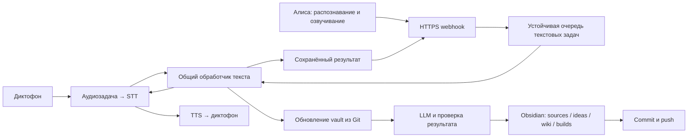

# Личный навык Алисы для Затеи — проект решения

Дата: 2026-09-27. Статус: предложение для обсуждения; реализация не начата.

## Цель и исходные допущения

Добавить Алису как второй голосовой вход в существующую Затею: захват мысли,
дополнение заметки, вопросы к базе, LLM Wiki, планы и задания по принципу
Ramble your idea, then build. Диктофон продолжает работать одновременно.
Под «build» сохраняем сегодняшнее поведение: подготовка задания в Obsidian,
а не самостоятельное исполнение кода.

План рассчитан на одного владельца, приватный навык и один существующий vault.
Многопользовательский сервис и отдельные vault не входят в первую реализацию.
Это допущение до ответа владельца на вопрос об аудитории навыка.

## Проверенные ограничения платформы

- Webhook должен ответить за 4,5 секунды вместе с сетевыми задержками.
  Поэтому LLM, Git и запись wiki выполняются в устойчивой фоновой очереди.
  Наш бюджет обработчика — 2 секунды; нормальный ответ после записи задания
  в SQLite должен занимать менее секунды. [Ожидание ответа](https://yandex.ru/dev/dialogs/alice/doc/ru/wait-response).
- Навык получает распознанный текст: `original_utterance` ограничен 1024
  символами; `command` нормализован. Для содержания сохраняем оригинальный
  текст. Длинную диктовку собираем из нескольких реплик. Нельзя обещать
  получение непрерывной десятиминутной аудиозаписи через этот протокол.
  [SimpleUtterance](https://yandex.ru/dev/dialogs/alice/doc/ru/request-simpleutterance).
- `response.text` и `response.tts` ограничены 1024 символами каждое.
  Навык возвращает короткий текст, озвучивание делает Алиса. Собственные
  STT/TTS Затеи в этом канале не вызываются.
  [Ответ](https://yandex.ru/dev/dialogs/alice/doc/ru/response).
- Для результата долгой операции используем следующую реплику пользователя
  («Готово?»), а не обещание самопроизвольного ответа колонки после завершения
  HTTP-запроса. Выход из навыка не отменяет уже принятое задание.
- Нужен доступный Яндексу HTTPS webhook с доверенным fullchain-сертификатом.
  Адрес `192.168.11.2:7070` напрямую не подходит. Для запуска предлагается
  имя «Моя затея»: оно отвечает базовому требованию двух слов, но итоговое
  активационное имя проверяется при модерации.
  [Настройки публикации](https://yandex.ru/dev/dialogs/alice/doc/ru/publish-settings).
- Приватный навык доступен владельцу и пользователям, которым он явно дал
  доступ; приватность не отменяет модерацию.
  [Доступ](https://yandex.ru/dev/dialogs/alice/doc/ru/access),
  [требования](https://yandex.ru/dev/dialogs/alice/doc/ru/requirements).

## Архитектурное решение

Выделить из `pipeline.py` участок после STT и до TTS в `text_turns.py`.
Оба канала используют один экземпляр этого сервиса, `AgentClient`,
`KnowledgeStore` и `GitSync`. Существующий аудиопротокол и прошивку не менять.
Не подделывать WAV для Алисы: нынешний `VoiceJobWorker` проверяет наличие
24 kHz WAV и не подходит для текстового результата.

Алиса получает собственную небольшую очередь SQLite и worker в том же
процессе backend. Redis, Celery и второй LLM-сервис не нужны. Критические
состояния хранятся в `data/archive/alice.sqlite3`, текстовые архивы — в
`data/archive/alice/<job-id>/`. State, присланный Алисой, не является источником
прав доступа и содержимого черновика.

Альтернативы: отдельный микросервис потребует дополнительной авторизации и
публичного текстового API; синхронный вызов существующего pipeline нарушит
срок ответа. Для текущего POC оба варианта хуже адаптера внутри gateway.

## Диалог

1. «Алиса, запусти навык Моя затея» → короткое приветствие и помощь.
2. «Запиши мысль: …» → сохранить текст и задание, ответить «Приняла мысль
   в обработку. Спросите “Готово?”, чтобы узнать результат».
3. «Начни запись» → открыть черновик. Каждая следующая содержательная реплика
   добавляет фрагмент, ответ «Приняла. Продолжайте».
4. «Закончи запись» → атомарно закрыть черновик и поставить одно задание.
   Пустой черновик не создаёт заметку. Общий предел черновика — 12 000
   символов; при переполнении не обрезать текст молча, предложить закончить.
5. «Дополни последнюю мысль…», «Что мы обсуждали про…», «Составь план…» →
   тот же смысловой контракт, что у диктофона: capture/amend/query/plan/build.
6. «Готово?» → сохранённый результат или честный статус обработки.
   «Сохранила» произносится только после подтверждения writer. Успех записи
   в vault и завершение Git push — разные состояния.
7. «Продолжи запись» восстанавливает незаконченный черновик после новой сессии.
   «Отмени черновик» требует подтверждения. «Выйти» завершает разговор,
   сохраняя черновик и ранее принятые задания.

Команды управления распознаются детерминированно до LLM и только как целые
реплики; упоминание слова «готово» внутри мысли не завершает запись.
Для буквальной диктовки управляющей фразы поддержать «Запиши дословно: …».
В черновике вопросы тоже записываются как содержание, пока он не закрыт.
За пределами черновика приветствие, помощь, статус и «проверка связи, заметку
не создавай» не создают содержательных заметок. Стартовая активационная
фраза не должна становиться текстом идеи; в MVP приветствие просит продиктовать
содержание следующей репликой.

## Общий владелец, история и параллельность

Сопоставлять проверенный Яндекс-аккаунт с контекстом существующего диктофона
через `ALICE_CONTEXT_DEVICE_ID`. Внутренний `context_id` обозначает общую
историю и последнюю идею; физический `client_id` и `channel=alice|recorder`
сохраняются отдельно для происхождения записи. Можно использовать нынешний
device ID как ключ контекста, сохраняя имеющуюся историю без миграции.

Общий сервис последовательно выполняет текстовые операции одного контекста:
обновление Git → чтение контекста → LLM → проверка → публикация → история.
Очерёдность начинается с поступления готового текста (у диктофона после STT).
LLM не держит файловый writer.lock. Git publisher продолжает использовать
существующую файловую блокировку; busy следует ограниченно подождать, а не
выдавать случайную ошибку из-за фонового fetch.

Перед дополнением зафиксировать выбранный target_id в задании/контексте;
повтор задания не должен переключаться на более новую заметку. Если цель
неоднозначна, запросить уточнение. Общий контекст одного владельца не означает
признание физического голоса говорящего: люди рядом с его колонкой могут
пользоваться открытым навыком от привязанного аккаунта.

## Долговечность и ошибки

Идемпотентность webhook: уникальный ключ `(skill_id, session_id, message_id)`
плюс проверенный владелец, хеш содержимого и сохранённый ответ. Повтор не
добавляет фрагмент/задачу; тот же ключ с другим текстом отклоняется.
Запись события, черновика/задания и ответа — одна транзакция.
Сначала commit SQLite, затем подтверждение приёма.

Статусы задания: queued/running/done/failed/needs_review. После перезапуска
running повторяется с прежним request_id; уже опубликованная заметка и история
не дублируются. Задачи читает worker из БД, а не только из памяти. Максимум
8 ожидающих задач, один черновик на владельца. У каждой задачи deadline 180 s;
тайм-аут не удаляет текст. Не выполнять бесконечные платные повторы LLM.
При конфликте Git/заметки вернуть понятную причину и сохранить исходный текст.

## Авторизация и публикация

Приватный навык + связка аккаунтов через Яндекс ID. Проверять OAuth access token
через `GET https://login.yandex.ru/info?format=json` с заголовком Authorization,
сопоставлять возвращённый `id` с `ALICE_ALLOWED_YANDEX_ID`. Это не то же самое,
что `session.user.user_id`. Полям user/skill в JSON доверять как данным, а не
как доказательству личности. Не писать токены, реплики или заметки в access logs.
Токен проверяется до любой постановки задачи или выдачи результата; timeout
проверки 1 s, успешный кэш не более 60 s, ключ кэша — хеш токена.
Отсутствие/отзыв токена запускает account linking, недоступность API — отказ
без доступа к vault. На колонке без интерфейса linking дать инструкцию
подключить аккаунт из приложения Яндекса.

Используем официальный механизм, не пишем свой OAuth-сервер:
[связка аккаунтов](https://yandex.ru/dev/dialogs/alice/doc/ru/auth/how-it-works),
[проверка токена](https://yandex.ru/dev/id/doc/ru/user-information).
Регистрация приложения и прохождение связывания на реальной поверхности —
первый внешний контрольный этап до подключения настоящего vault.

Публиковать только `POST /api/alice/webhook` через reverse proxy. Остальные
API, архив, `/docs`, `/metrics` и настройки не выставлять этим маршрутом.
Установить ограничение тела 64 KiB и частоты 30 запросов/минуту на владельца;
проверочные ping отвечают без данных, LLM и задач. Для ingress предусмотрен
общий лимит до OAuth-проверки. HTTPS сам по себе не доказывает отправителя.

Предпочтителен существующий reverse proxy с доменом. Если его нет, добавить
опциональный Caddy в тот же Compose, с `./data/caddy/` для постоянных данных.
При отсутствии входящего доступа на домашний сервер потребуется публичный
прокси с приватным туннелем до него; конкретную сеть выбираем после проверки
домена и маршрутизации, не меняя сеть работающего диктофона в рамках плана.

## Критерии готовности

Новая идея из Алисы появляется в общем vault с источником и wiki, проходит
commit/push. Дополнение с другого канала меняет нужную заметку. Query не
создаёт идею. Черновики и задания переживают рестарт, дубликаты webhook не
дублируют записи. При LLM дольше 4,5 s навык продолжает отвечать на статус.
Авторизация блокирует чужой аккаунт и поддельные user_id. Все тесты диктофона
проходят; реальная запись с него и сценарии Алисы проверяются отдельно.
